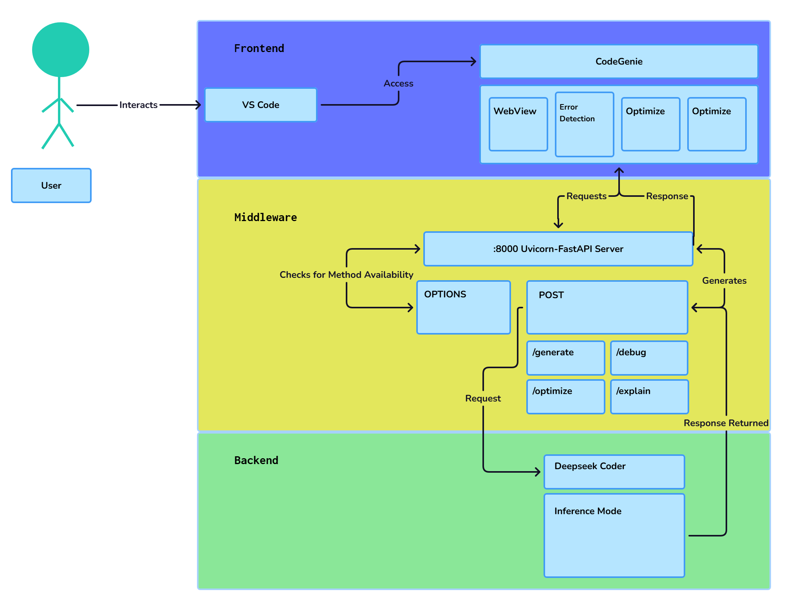
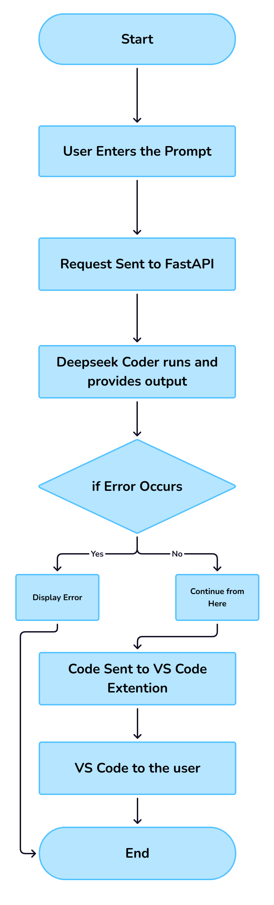

#  CodeGenie — AI-Powered VS Code Extension

**CodeGenie** is a Visual Studio Code extension that integrates generative AI directly into your coding workflow. Designed by developers, for developers — it empowers users with intelligent suggestions, code generation, debugging assistance, and more.

---

# 🚀 Introduction

**CodeGenie** is an AI-powered coding assistant designed to **revolutionize the software development workflow**. Built on top of the powerful **DeepSeek-Coder** models, it brings intelligent, context-aware coding assistance directly into your editor — helping you write better code, faster.

With native **Visual Studio Code integration** and support for a wide range of programming languages and frameworks, CodeGenie enables developers to:

- ✅ **Generate accurate, context-sensitive code suggestions**  
- 🛠️ **Detect and fix errors in real-time**  
- ⚙️ **Refactor and optimize code for performance and clarity**  
- 🌐 **Work seamlessly across technologies**, from web to machine learning

Whether you're prototyping a web app, building data pipelines, or debugging legacy code, CodeGenie empowers you to stay in flow, reduce cognitive load, and focus on what matters most — building great software.

---

# 💡 Use Cases

Here’s how CodeGenie supports developers across domains:

### 🌐 Web Development
- Generate and refine frontend code (HTML, CSS, JavaScript)  
- Build backend services with Node.js, Django, Flask, and more

### 🤖 Machine Learning & Data Science
- Generate model training scripts and evaluation code  
- Create data cleaning, preprocessing, and visualization pipelines

### 🛠️ General Software Engineering
- Automate boilerplate code generation  
- Implement design patterns and follow best practices  
- Refactor and maintain large codebases

### 🐞 Debugging
- Detect bugs and suggest intelligent fixes in real-time  
- Explain code behavior to assist in troubleshooting

### 📘 Learning & Exploration
- Use natural language to explore code functionality  
- Learn programming concepts with contextual examples  

---

## 📐 Architecture Diagram (DeepSeek Coder V2)

  

---

## 🔄 Workflow Diagram

  

---

### 📜 License & Acknowledgments

CodeGenie is released under the **MIT License**, permitting free use, modification, and distribution for personal and commercial purposes.

This project utilizes [DeepSeek-Coder](https://github.com/deepseek-ai/DeepSeek-Coder), which is governed by the **DeepSeek License Agreement Version 1.0 (October 2023)**. This license grants broad rights to use, reproduce, and distribute the model and its derivatives, but also includes important **use-based restrictions** to ensure responsible and lawful usage.

#### Important Use Restrictions from DeepSeek License:

- No use violating applicable laws or infringing third-party rights  
- No military use  
- No generating harmful, false, or inappropriate content  
- No unauthorized dissemination of personal data  
- No discriminatory or harmful uses against individuals or groups  

By using CodeGenie, you agree to comply with all relevant terms of the DeepSeek License, including these use-based restrictions, and assume responsibility for your use of outputs generated via the model.

For full details, please review the [DeepSeek License Agreement](https://github.com/deepseek-ai/DeepSeek-Coder/blob/main/LICENSE-MODEL) and associated documentation.

---

#### 🔗 Repositories

| Project          | Link                                                                                      |
|------------------|-------------------------------------------------------------------------------------------|
| **CodeGenie**      | [github.com/kmitofficial/CodeGenie-G336-PS25](https://github.com/kmitofficial/CodeGenie-G336-PS25)   |
| **DeepSeek-Coder** | [github.com/deepseek-ai/DeepSeek-Coder](https://github.com/deepseek-ai/DeepSeek-Coder)               |

---

## 🙌 Contributors

- [Mahesh Kiran](https://github.com/Mahesh-Kiran)
- [Krishna Chaitanya](https://github.com/Krishna752006)
- [Sneha](https://github.com/sneha123-reddy)
- [AASRITH CODER](https://github.com/AASRITHCODER)
- [Triveni](https://github.com/AdepuTriveni)
- [Lokesh Vasireddy](https://github.com/LokeshVasireddy)

---

## Reference Videos

- **Mahesh Kiran** : https://www.youtube.com/
- **Krishna Chaitanya** : https://youtu.be/
- **Sneha** : https://youtu.be/
- **AASRITH** : https://www.youtube.com/
- **Triveni** : https://youtu.be/
- **Lokesh Vasireddy** : https://youtu.be/

---

🔥 Get ready to build the future of **AI-powered development** with **CodeGenie**! 🚀
